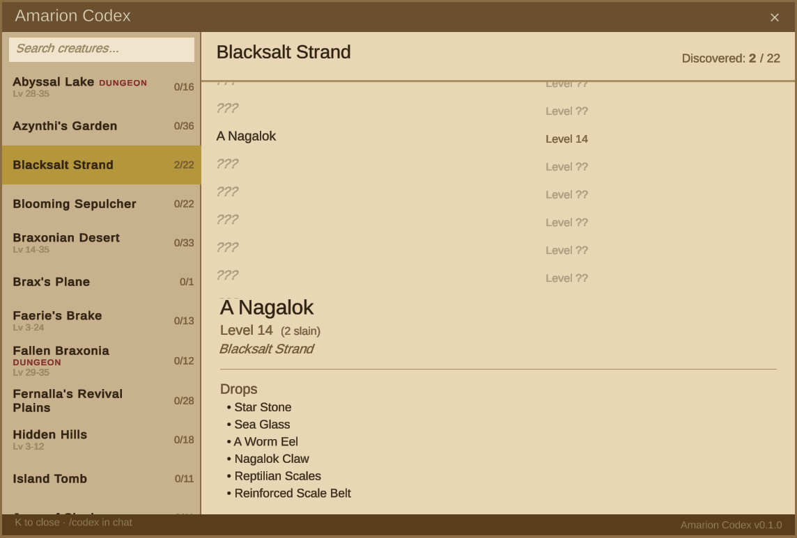

# Amarion Codex

An in-game bestiary/knowledge database mod for [Erenshor](https://store.steampowered.com/app/2382520/Erenshor/). Tracks enemies and NPCs the player has encountered through combat, conversation, or the consider command. Undiscovered entries show as question marks. Content is organized by game zone.



## Features

- **905 NPCs** across **45 zones** with loot tables, quest associations, and level data
- Discover NPCs through combat (aggro), hailing, considering, or killing
- Group and raid members trigger discoveries when NPCs aggro on them
- Browse discovered entries organized by zone/dungeon with level ranges
- View NPC details: level, loot tables, quest associations, kill count
- **Clickable loot items** — click any drop to inspect full item stats via the game's item window
- Undiscovered entries shown as `???` placeholders with discovery count per zone
- Search across all discovered entries
- Open with keybind (default: K) or chat commands (`/codex`, `/bestiary`)
- Per-character save data, persisted alongside game saves
- Reset progress with `/codexreset`

## Requirements

- [Erenshor](https://store.steampowered.com/app/2382520/Erenshor/) (or Erenshor Playtest)
- **One** of:
  - [BepInEx 5.4.x](https://github.com/BepInEx/BepInEx/releases) installed into your Erenshor directory
  - [Lunaris Mod Manager](https://github.com/MizukiBelhi/Lunaris) (includes its own loader)

## Installation

### Via Lunaris Mod Manager (recommended)

1. Install from the Lunaris Vault (search "Amarion Codex"), or
2. Download `AmarionCodex.dll` and place it in `<Erenshor>/plugins/AmarionCodex/`

### Via BepInEx

1. Install BepInEx 5.4.x into your Erenshor game directory if you haven't already
2. Download `AmarionCodex.dll` from the [Releases](../../releases) page
3. Copy the file to `<Erenshor>/BepInEx/plugins/AmarionCodex/`
4. Launch the game

## Building from Source

### Prerequisites

- [.NET SDK](https://dotnet.microsoft.com/download) (with .NET Framework 4.8 targeting pack)
- Erenshor installed (the build references game DLLs directly)

> **Note:** Both mod loader entry points are compiled into a single DLL, so `Lunaris.dll` must be present in the game directory at build time even if you only use BepInEx. Lunaris is auto-downloaded when the game launches — run the game once to obtain it.

### Build

The project auto-detects your Erenshor install if it's in the default Steam location. Otherwise, pass the path explicitly:

```bash
dotnet build AmarionCodex/AmarionCodex.csproj -p:ErenshorDir="C:\path\to\Erenshor"
```

Or set the `ERENSHOR_DIR` environment variable:

```bash
set ERENSHOR_DIR=C:\path\to\Erenshor
dotnet build AmarionCodex/AmarionCodex.csproj
```

The build defaults to Release configuration. Output goes to `AmarionCodex/bin/Release/net48/AmarionCodex.dll`.

If Erenshor is detected, the DLL is auto-deployed to both `<Erenshor>/BepInEx/plugins/AmarionCodex/` and `<Erenshor>/plugins/AmarionCodex/` (Lunaris).

### Auto-detection paths

The build checks these locations in order:

1. `-p:ErenshorDir=` parameter
2. `ERENSHOR_DIR` environment variable
3. `C:\Program Files (x86)\Steam\steamapps\common\Erenshor Playtest`
4. `C:\Program Files (x86)\Steam\steamapps\common\Erenshor`

## Antivirus Note

Windows Defender may flag this DLL as a false positive. This is common for BepInEx/Harmony mods because runtime method patching uses techniques that resemble code injection to heuristic scanners. The mod contains no malicious code — you can review the full source in the `AmarionCodex/` directory.

If flagged, add an exclusion for your `BepInEx/plugins/` folder in Windows Security settings.

## Changelog

### 0.3.0
- Added Lunaris Mod Manager compatibility — single DLL works with both BepInEx and Lunaris
- Hot-reload safe: clean unload/reload via Lunaris without stale state
- Target framework updated to .NET 4.8

### 0.2.3
- Clickable loot items — click any item in an NPC's drop list to open the game's native item inspection window with full stats, lore, and class requirements
- Fixed typo in bestiary data: "Abominal Ribcage" → "Abominable Ribcage"

### 0.2.2
- Simplified quest display to a single deduplicated list
- Renamed planar zones to match in-game display names
- Fixed Mysterious Portals discovery by adding scene-to-zone mapping
- Fixed NPC zone assignments and removed invalid entries

### 0.2.1
- Fixed crash caused by `SimPlayer.InRaid` not existing in retail builds (playtest-only field), which propagated through `SpellVessel.ResolveSpell` and caused "Spell did not complete" errors
- Added null guards with logging across all Harmony patches (MyStats, AggroTable, NPCName) to prevent unhandled exceptions from propagating into game systems
- `InRaid` check now uses reflection — works on playtest, safely skipped on retail

### 0.2.0
- Initial public release

## License

[MIT](LICENSE)
